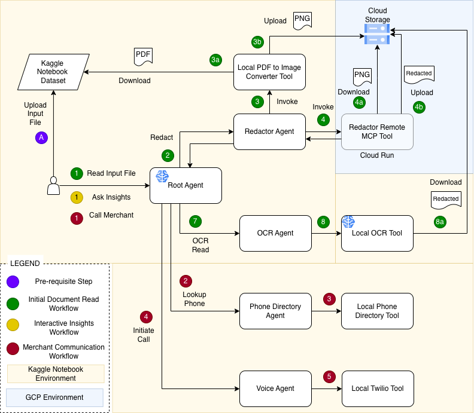

# cloak-ledger

cloak-ledger is a privacy-first, AI-driven financial statement processing system. It supports uploading credit-card or billing PDFs, redacting personally identifiable information (PII), extracting the statement contents via OCR, letting users analyze and inspect charges, and (optionally) connect with merchants by phone using integrated Twilio support — all while keeping original data secure.

---

## 🔎 What cloak-ledger Does

- **Secure redaction:** Converts uploaded PDFs into images, then uses a redaction tool to remove sensitive PII. Only the redacted version is stored or processed further.  
- **Automatic OCR extraction:** Runs OCR on redacted documents to extract readable transaction data, totals, fees, subscriptions, and more — delivering structured text for analysis.  
- **Financial analysis & insights:** Allows users to ask questions about their spending statements (duplicate charges, recurring subscriptions, interest/fee breakdowns, etc.) based solely on redacted data.  
- **Merchant phone directory & call integration:** Maps merchant names (e.g., “StreamFlix”, “WholeLife Gym”) to phone numbers, and can automatically initiate a call between the user and the merchant via Twilio — optionally navigating IVRs or bridging calls.  
- **Strict privacy-first design:** The original (unredacted) documents are never opened by the LLM. Sensitive data is redacted first, and only sanitized content is processed or exposed.  

In short — cloak-ledger is a full pipeline: **upload → redact → read → analyze → act (call)**.

---

## 🏗 Architecture Overview

The system is built as a collection of specialized agents:

| Agent | Role |
|-------|------|
| **Orchestrator Agent** | Coordinates the overall workflow: receives user requests, routes them to appropriate sub-agents (redactor, OCR, phone directory, voice), and keeps document context. |
| **Redactor Agent** | Takes a PDF filename, converts it to image, applies redaction through MCP tooling, returns only redacted file name — never sees unredacted content. |
| **OCR Agent** | Downloads the redacted image from storage, runs OCR (via Gemini/Vision), returns structured extracted text (e.g. `{"ocr_text": "..."}`), and never processes original files. |
| **Phone Directory Agent** | Provides a deterministic lookup from merchant name → phone number using a simple hard-coded (or configurable) directory; avoids hallucinations. |
| **Voice Agent** | When requested, collects the user’s phone number, retrieves merchant number, and uses Twilio to call the user first, play a prompt, and connect to the merchant. |
| **Storage & MCP Server** | Secure backend: redacted images stored in Google Cloud Storage; redaction/conversion tools exposed via MCP server running on Cloud Run. |
| **Front-End (Kaggle Notebook / ADK Web UI)** | Provides the user interface: users upload PDFs, interact with agents, review insights, and trigger calls — all in a browser environment. |

This modular design ensures each agent has a narrow, well-defined responsibility, enhancing privacy, maintainability, and extensibility.


---

## 🚀 Quick Demo / User Flow

1. **User uploads a billing or credit-card PDF** (e.g., via Kaggle or UI).  
2. User says:  
   > “Read file `my_statement_2025_01`. Analyze charges.”  
3. Behind the scenes:  
   - Orchestrator calls Redactor → receives redacted file name.  
   - Then calls OCR Agent → extracts text and stores it internally.  
4. Agent responds:  
   > “Your document ‘my_statement_2025_01’ has been redacted and processed. I’m ready to answer questions.”  
5. User asks:  
   > “Show me all recurring subscriptions.”  
6. Agent outputs a list (e.g., “StreamFlix – \$15.99, MusicNow – \$9.99, WholeLife Gym – \$59.00”).  
7. User says:  
   > “Connect me to StreamFlix.”  
8. Orchestrator → Phone Directory → Voice Agent → Twilio initiates a real call between the user and the merchant.  
9. Agent confirms:  
   > “Calling StreamFlix now — you should receive a call momentarily. Twilio Call ID: XXX.”  

---

## 🛠 Installation & Setup
The PII scrubber/Redactor MCP Server is part of this Github while the rest of the code is in Kaggle notebook: https://www.kaggle.com/code/vgthoppae/root-cloak-ledger.

```bash
# Clone the repo
git clone https://github.com/vgthoppae/cloak-ledger.git
cd cloak-ledger/pii_scrubber

# Build or install dependencies (e.g. in Python environment)
pip install -r requirements.txt

# Start the MCP redaction & conversion server (if containerized)
docker build -t cloak-ledger-mcp .
docker run -p 8000:8000 cloak-ledger-mcp

---

## Redaction Process

**Step 1: Full OCR Read**
The entire document content is read using opencv-python library into a list of dictionary objects in the below format.
```
      {
          "text": "Invoice",
          "left": 100, "top": 50, "width": 60, "height": 20,
          "conf": 90 (confidence score)
      }
```
*Step 2: Plan Redact*
**The textual content spread around dict objects is constructed into a contiguous text.**
**Pattern recognition is applied over the text content using Microsoft Presidio engine which supports standard out of the box patterns such as SSN, NAME etc.**
**Cloak-Ledger defines custom patterns to recognize tax ids, account numbers and bank routing numbers. This is a potential area for customization in a productio grade
   implementation to enable users define patterns specific to their document.**
**Map the above recognized texts to their bounding boxes from the OCR result**

*Step 3: Apply Redaction*
**Draw rectangle around the identified areas above**

